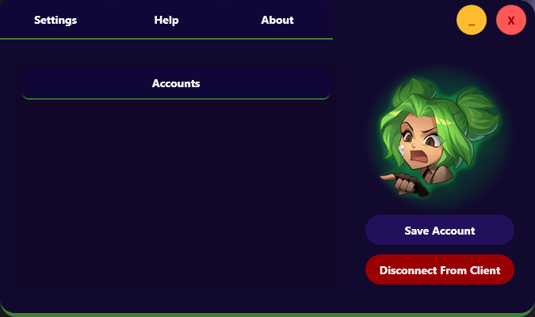
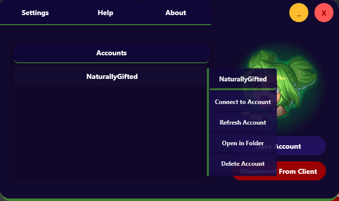

# Lol Account Manager

Lol Account Manager is a user-friendly application designed to simplify the management of League of Legends (LoL) accounts. Whether you have multiple accounts or need a convenient way to handle your credentials, this tool offers a streamlined solution.
## Key Features

 - Effortless Login: Log in seamlessly using your username and password.
 - Account Management: Add, modify, and delete LoL accounts effortlessly.
 - Modern UI: Enjoy a clean and modern user interface for a pleasant user experience. 

## Screenshots

## Installation

Download Setup of last version in [Release](https://github.com/Marin-Clement/LolAccountManager/releases) Tab.

## Thanks You

Thank you for using Lol Account Manager! Your support and feedback are greatly appreciated. If you have any suggestions, encounter issues, or want to contribute to the project, feel free to open an issue or submit a pull request.
